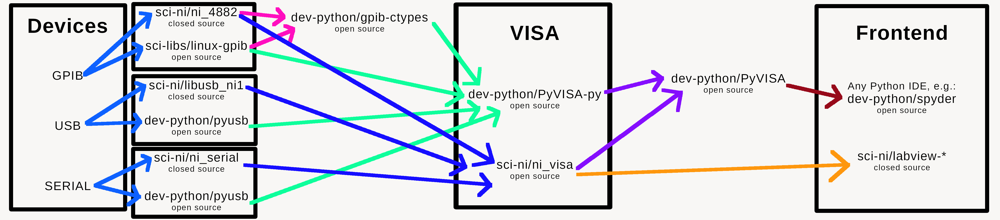

# VISA, DAQ and NatInst ebuild repository
[](https://github.com/AndrewAmmerlaan/natinst/actions?query=workflow%3Apkgcheck)

This ebuild repository contains ebuilds for: VISA (Virtual Instrument Software Architecture), DAQ (Data acquisition), National Instruments devices, and LabVIEW.
The ebuilds in the `sci-ni/` category are generated with two scripts.
The first generates "ebuild-wrappers" around the rpm files located at [download.ni.com/ni-linux-desktop](https://download.ni.com/ni-linux-desktop/). The second does the same for a collection of fetch-restricted rpm files located in a local directory.
To use the latter ebuilds you will need access to the [LabVIEW](https://www.ni.com/en-us/support/downloads/software-products/download.labview.html) rpm files from National Instruments.

If you encounter any problems, please open an Issue. And if you have an ebuild which would be a good addition to this repository, please open a Pull Request.

### Usage



The above diagram shows how you can use the different drivers and VISA software to interact with your devices.
The devices supported by `sci-libs/linux-gpib` can be found [here](https://linux-gpib.sourceforge.io/doc_html/supported-hardware.html) and the devices supported by `sci-ni/ni_4882` can be found [here](https://www.ni.com/en-us/support/documentation/supplemental/06/ni-488-2-supported-versions-for-gpib-devices-and-modules.html).
Note that, at the time of writing, `sci-ni/ni_4882` does __not__ support GPIB to USB devices due to the Linux kernel's USB driver stack being licensed GPL.
This means that it is __not__ possible to interact with GPIB to USB devices in LabVIEW on Linux.
You can still use the open source driver `sci-libs/linux-gpib` to interact with these devices using e.g. Python.
On the other hand, `sci-libs/linux-gpib` currently does __not__ support GPIB to ENET devices, which are supported by `sci-ni/ni_4882`.

After installng any National Instruments driver package (e.g. `sci-ni/ni_visa`), the driver will first need to be built for your kernel. 
To do this use `sys-kernel/dkms`, the driver should have been automatically added to the dkms database in the driver's package post-install phase. 
You can view all drivers added to the database with:

```
dkms status
```

Build all drivers for the currently running kernel with:


```
dkms autoinstall
```

If you encounter any issues building the drivers for your kernel, re-try with the preceeding LTS kernel release, e.g.:

```
emerge gentoo-sources:5.14.15
dkms autoinstall -k 5.14.15-gentoo
```

At the time of writing the latest kernel version compatible with the NI-drivers is 5.14.

Now reboot to the kernel you built the modules for, and start the relevant service with:

```
rc-service nipal start
```

Note that simply running `modprobe nipalk` is not enough. 
Applications such as `visaconf` require the service to be running, otherwise it will fail with an error suggesting that the module `nipalk` is not loaded even if the module actually is loaded.

Optionally, add the service to the default runlevel to automatically start it at boot:

```
rc-update add nipal default
```

Now you should be able to run `visaconf` from the terminal or through the desktop shortcut to configure VISA.

### Disclaimer

Neither myself nor this repository is in any way associated with National Instruments.
National Instruments cannot be held accountable for the ebuilds contained in this repository, nor can I be held accountable for the software contained in the rpm files distributed by National Instruments.

## Upgrading LabVIEW

I recommend removing the old LabVIEW version with `emerge -C` before installing the new version. If you do it the other way around the uninstall scripts of the old version will remove files that the new version still needs. Note that unmerging LabVIEW leaves some files behind in `/usr/local`, `/etc/`, `/usr/share/applications` and possibly other locations as well, you can remove these files manually.
